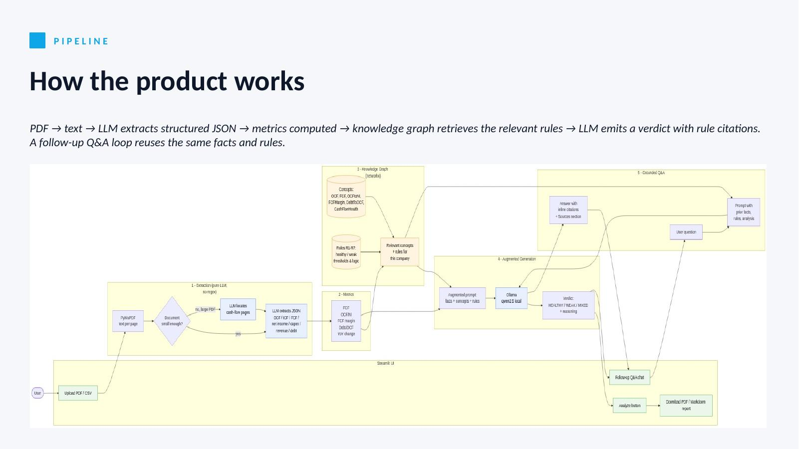

# KAG Cash-Flow Analyzer

> Analyze whether a company's cash flow is **HEALTHY**, **WEAK**, or **MIXED** — fully local, no API key required.

Powered by a domain **knowledge graph** + a local [Ollama](https://ollama.com) LLM. Accepts real-world cash-flow PDFs (including IDX-style Indonesian disclosures) or simple CSVs, and produces a downloadable PDF + Markdown report.



---

## What is KAG?

**Knowledge Augmented Generation** grounds an LLM in **structured domain knowledge** — a knowledge graph of concepts, relationships, and rules — rather than in raw text chunks. It was popularized by Ant Group's [OpenSPG / KAG framework](https://github.com/OpenSPG/KAG) in 2024.

### KAG vs. RAG

| | RAG (Retrieval-Augmented Generation) | KAG (Knowledge-Augmented Generation) |
|---|---|---|
| Knowledge store | Vector DB of text chunks | Knowledge graph of entities, relations, rules |
| Retrieval | Semantic similarity over embeddings | Graph traversal + symbolic query |
| Grounding | "Here are paragraphs that look similar" | "Here are the exact concepts and rules that apply" |
| Numbers / thresholds | Weak — often lost in chunks | Strong — rules are first-class nodes |
| Explainability | Cites passages | Cites rule IDs (R1, R2 …) |
| Needs a vector DB? | Yes | No |

**RAG gives the model text to read. KAG gives it facts and rules to reason with.**

For structured domains like finance — where the right answer depends on well-defined thresholds (OCF/NI > 1, FCF margin > 10%, Debt/OCF < 4) — KAG is more reliable and easier to audit.

---

## How the pipeline works

```
PDF                              CSV (pre-structured)
  │                                │
  ▼                                │
PyMuPDF → raw text                 │
  │                                │
  ▼                                │
Ollama LLM → structured JSON ──────┘
  (extracts OCF, ICF, FCF,
   net income, capex, debt,
   revenue from any layout)
    │
    ▼
compute derived metrics
    FCF = OCF − CapEx
    OCF/NI, FCF margin, Debt/OCF, YoY change …
    │
    ▼
Knowledge Graph (networkx)
    • concepts  →  OperatingCashFlow, FreeCashFlow, FCFMargin, DebtToOCF …
    • rules     →  R1 through R7, each linked to the concept it governs
    │
    ▼  graph traversal
retrieve matching concepts + rules
    │
    ▼
build augmented prompt  (definitions + rules + computed facts)
    │
    ▼
Ollama LLM  →  verdict citing rule IDs
    │
    ▼
PDF + Markdown report
```

### Knowledge graph rules

| ID | Rule |
|----|------|
| R1 | Positive and growing OCF → healthy operations |
| R2 | OCF/NI > 1; below 1 may indicate aggressive accounting |
| R3 | FCF > 0 means the company funds growth internally |
| R4 | FCF margin > 10% strong; < 5% weak for mature firms |
| R5 | Debt/OCF > 4 elevated leverage; > 6 is concerning |
| R6 | Positive financing CF + negative OCF = cash burn funded externally |
| R7 | Sharp YoY drops in OCF warrant investigation |

Rules are plain nodes in the graph. Adding a new rule is a one-line change in `knowledge_graph.py` — no prompt editing needed.

---

## Quick start

### 1. Prerequisites

- Python 3.10+
- [Ollama](https://ollama.com) installed and running

```bash
# pull a model (pick one)
ollama pull granite3.2-vision  # default — best for documents with visual structures (tables/layouts)
ollama pull qwen2.5            # strong JSON compliance
ollama pull qwen2.5:3b         # faster alternative for laptops
ollama pull llama3.2           # fast alternative
ollama pull phi3               # lower-end machine alternative

# Ollama typically starts automatically on install.
# If "address already in use" when running `ollama serve`,
# it's already running — just `curl http://localhost:11434/api/version` to confirm.
```

### 2. Install Python dependencies

```bash
pip install -r requirements.txt
```

### 3. Launch the Streamlit app

```bash
streamlit run streamlit_app.py
```

Then open **http://localhost:8501** in your browser.

---

## Using the Streamlit UI

The app is divided into four steps shown on one page:

**Sidebar**
- Choose the Ollama model to use.
- Toggle **Dry-run** to skip the LLM and just inspect the augmented prompt.
- Browse the knowledge graph — all 7 rules are listed with their full text.

**Step 1 — Upload**
Upload a CSV or PDF, or tick *"Use bundled sample"* to try the AcmeCorp demo data instantly.
For PDFs, **the LLM reads the company name, reporting year, currency, and unit scale directly from the document** (including headers like *"dalam jutaan Rupiah"*). A small "LLM auto-extracted" panel shows you what it read. An **Override** expander is available if you need to correct a mis-read.

**Step 2 — Extracted facts**
The parsed rows are shown in a table so you can verify the data before running the analysis.

**Step 3 — Analyze**
Click **Analyze**. For each reporting period the app shows:
- computed metrics (FCF, OCF/NI, FCF margin, Debt/OCF, YoY change)
- the rules retrieved from the knowledge graph
- the full augmented prompt (expandable)
- the LLM verdict with rule-cited reasoning

**Step 4 — Download report**
After analysis completes, download your report as:
- **PDF** — executive summary table (colour-coded verdicts) + per-period detail pages
- **Markdown** — same content, easy to paste into docs or emails

**Step 5 — Ask follow-up questions**
A chat panel appears after the analysis runs. Ask anything — *"Is leverage concerning?"*, *"Why is 2025 weaker?"*, *"What would push this back to HEALTHY?"* — and the LLM answers **using only** the retrieved KG rules, the extracted facts, and the prior verdict. Every answer ends with a **Sources** section listing exactly which rules (R1, R2 …) and which facts (e.g. `operating_cash_flow = 820 150 000`) were used. Four one-click suggested questions are provided to get you started.

---

## Command-line usage

The CLI is useful for scripting or batch processing.

```bash
# CSV, print to terminal
python analyze.py sample_cashflow.csv --company AcmeCorp --model granite3.2-vision

# PDF — everything (company, year, unit scale, numbers) is extracted by the LLM
python analyze.py filing.pdf --model granite3.2-vision

# Override any field if the LLM misreads it
python analyze.py filing.pdf --company "PT ABC Tbk" --year 2024 --scale 1000000

# Generate both report formats at once
python analyze.py sample_cashflow.csv --company AcmeCorp --model granite3.2-vision \
    --report cashflow_report.pdf --report-md cashflow_report.md

# Dry-run: print the augmented prompt only, no LLM call
python analyze.py sample_cashflow.csv --company AcmeCorp --dry-run
```

CLI arguments:

| Flag | Default | Description |
|---|---|---|
| `path` | — | CSV or PDF file to analyze |
| `--company` | LLM-extracted | Filter rows (CSV) or override extracted name (PDF) |
| `--year` | LLM-extracted | Override the extracted reporting year (PDF only) |
| `--scale` | LLM-inferred | Override the inferred unit scale (e.g. `1000000` for millions) |
| `--model` | `granite3.2-vision` | Ollama model name |
| `--report` | — | Output PDF report path |
| `--report-md` | — | Output Markdown report path |
| `--dry-run` | off | Skip the LLM; print the augmented prompt instead |

---

## Supported document formats

**PDF** — the primary input format. Upload any cash-flow statement and the LLM extracts all fields automatically. No manual label matching, no regex rules. Works with:
- IDX-style Indonesian disclosures (Bahasa Indonesia)
- English-language annual reports and 10-Ks
- Mixed-language documents
- Any layout, including multi-column and scanned-then-OCR'd PDFs

`pdf_extract.py` pulls the raw text from every page with **PyMuPDF** (`pymupdf`) — a C-backed extractor that's 10–20× faster than pdfplumber on large PDFs — then sends it to your local Ollama model with a structured JSON extraction prompt. For documents bigger than ~20 KB of text, a fast "locate pass" first asks the model which pages hold the cash-flow statement; only those pages (plus one neighbour on each side) are sent to the extraction pass. The LLM figures out the correct line items, extracts **company name, reporting year, currency, and unit scale** from the document header (e.g. *"dalam jutaan Rupiah"* → ×1 000 000), handles Indonesian number formats (`1.234.567`), parenthesised negatives (`(415.700)`), and arbitrary section headers on its own.

> You can override any auto-extracted field via the CLI flags or the Streamlit UI's "Override" expander, but by default you don't need to fill in anything — just upload the PDF.

### Performance tuning

The extractor is configured for speed: `num_ctx` capped at 8 K, `num_predict` capped at 512, per-page locate snippets trimmed to 400 chars, and `keep_alive: "30m"` so the model stays resident in RAM between calls.

Rough timings on an Apple M-series laptop:

| PDF size | Model | Time |
|---|---|---|
| 1–2 page IDX disclosure | `qwen2.5:3b` | ~8 s |
| 1–2 page IDX disclosure | `qwen2.5` (7B) | ~25 s |
| 265-page Medco prospectus | `qwen2.5:3b` | ~20 s (locate + extract) |
| 265-page Medco prospectus | `qwen2.5` (7B) | ~50 s |

If extraction feels slow, switch the sidebar model to `qwen2.5:3b`.

**CSV** — for structured data you already have. One row per company-year with columns: `company`, `year`, `operating_cash_flow`, `investing_cash_flow`, `financing_cash_flow`, `net_income`, `capex`, `total_debt`, `revenue`. See `sample_cashflow.csv` for an example.

---

## Files

| File | Purpose |
|---|---|
| `streamlit_app.py` | Main Streamlit UI — upload, analyze, download report |
| `analyze.py` | CLI entry point and shared pipeline logic |
| `knowledge_graph.py` | Domain KG: concepts, relationships, and rules R1–R7 |
| `pdf_extract.py` | PyMuPDF text extraction + LLM-based cash-flow field extraction |
| `architecture.mermaid` / `architecture.png` | Pipeline diagram |
| `report.py` | Generates PDF and Markdown reports from analysis results |
| `qa.py` | Grounded follow-up Q&A — answers cite KG rule IDs and extracted facts |
| `sample_cashflow.csv` | Demo data: AcmeCorp over 3 years (trend deliberately degrades in 2025) |
| `requirements.txt` | Python dependencies |

---

## Extending the project

**Add more rules** — open `knowledge_graph.py` and append a new `(rid, text, concept)` tuple to the `rules` list. The retrieval and prompt-building code picks it up automatically.

**Ingest more PDF layouts** — no code changes required. PDF extraction is pure LLM: PyMuPDF pulls the text, then the LLM reads it. Any new filing format just works. To tune behaviour, edit the `EXTRACT_SCHEMA` and `EXTRACT_PROMPT` in `pdf_extract.py`.

**Add multi-year trend rules** — the `compute_metrics()` function already computes YoY OCF change. Add a rule node `R8` linked to `OperatingCashFlow` and it will be included automatically when the metric is available.

**Scale up the KG** — for hundreds of concepts, export the graph to Neo4j or an RDF store and query it with Cypher / SPARQL. The rest of the pipeline is unchanged.

**Hybrid KAG + RAG** — if you also have unstructured auditor notes or MD&A text, add a vector retrieval step alongside the graph traversal. Both retrieved contexts can be injected into the same prompt.

---

## Further reading

- OpenSPG / KAG framework — https://github.com/OpenSPG/KAG
- *KAG: Boosting LLMs in Professional Domains via Knowledge Augmented Generation* ([Liang et al., 2024](https://arxiv.org/abs/2409.13731))
- Ollama model library — https://ollama.com/library
